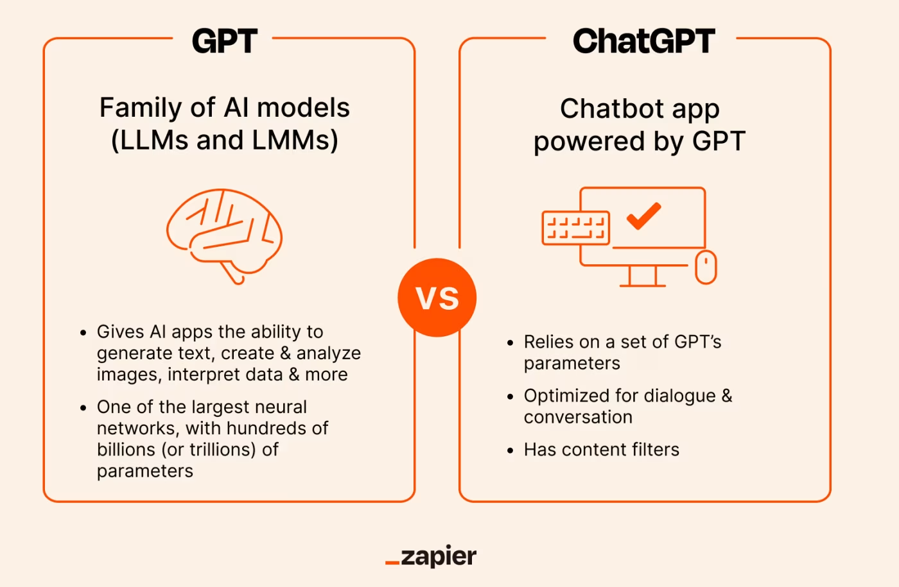

# Large Language Models (LLMs) for Exploratory Research

Welcome to the LLMs for Exploratory Research workshop.

In a fast evolving artificial intelligence landscape, LLMs such as GPT have become a common buzzword. In the research community, their advantages and pitfalls are hotly debated. In this workshop, we will explore different chatbots powered by LLMs, beyond just ChatGPT. Our main goal will be to understand how LLMs can be used by researchers to conduct early-stage (or exploratory) research. Throughout the workshop, we will discuss best practices for prompt engineering and heuristics to evaluate the suitability of an LLM's output for our research purposes. Though the workshop primarily focuses on early-stage research, we will briefly discuss the use cases of LLMs in later stages of research, such as data analysis and writing.

## Learning Objectives

Our goals for today's workshop are:

1.  Explore different chatbots powered by Large Language Models (LLMs).

2.  Explore use cases for LLMs in exploratory research.

3.  Compare and contrast output from different LLMs.

Throughout this workshop series, we will use the following icons:

🔔 **Question**: A quick question to help you understand what's going on.

🥊 **Challenge**: Interactive exercise. We'll go through these in the workshop!

⚠️ **Warning**: Heads-up about tricky stuff or common mistakes.

💡 **Tip**: How to do something a bit more efficiently or effectively.

📝 **Poll**: A zoom poll to help you learn.

🎬 **Demo**: Showing off something more advanced so you know what you can use LLMs for in the future

## Introduction

We are probably all familiar with ChatGPT which uses an LLM called GPT, either having used it ourselves or heard about it.

💡 **Note:** There is a difference between an LLM and an LLM-powered chatbot [(Source: Zapier)](https://zapier.com/blog/chatgpt-vs-gpt/).

{style="display: block; margin: 1em auto" width="300"}

There are several LLMs beyond GPT that can be useful for research.

🔔 **Question**: What is your current favorite LLM chatbot?

In today's workshop, we will explore a handful of LLMs that can be used through chatbots on the internet and do not require local installation. Note that most of these have free versions with limited capabilities and to access the full host of features, paid subscriptions are required. We will be working with free versions of most LLMs. However, all UC Berkeley affiliates have access to the premium version of Perplexity, which gives us access to GPT-4 and Claude 3. To activate your free Perplexity Pro account, you can sign up with your Berkeley email address on [this link](https://www.perplexity.ai/).

We will explore the interface of the following LLM-powered AI chatbots in today's workshop:

-   ChatGPT (uses GPT)

-   Perplexity Pro (uses GPT and Claude)

-   Claude.ai (uses Claude 3.5 Sonnet)

-   Phind (uses Phind Model)

Note that these are only four of several chatbots powered by different LLMs. Many others, such as Meta's Llama and Google's Gemini, can be used for various research tasks as well.

In today's workshop we will explore the uses of these LLMs following the structure of an exploratory research process.

-   We will start by using an LLM to summarize a research paper.

-   Then, we will design a research question based on the paper we summarize.

-   We will take the help of an LLM to come up with a potential research design to answer our research question.

-   We will end with using an LLM to come up with a structure for our research paper.

## Stage 1: Framing a Research Question

There are many different ways to choose a research question - you may start with a dataset, an empirical observation about the world, or two variables that seem to be associated with each other. Being able to articulate a precise research question, regardless of where you start, is important for a strong introduction to any paper.

🔔 **Question**: How do you usually come up with research questions in your field?

Before developing a research question, let's get a summary of the paper we will be referencing throughout today's workshop. The paper by Gerber, Green, and Larimer (2008) is one of the most cited papers in the political science field. It asks whether social norms can increase voter turnout during elections and is based on a large-scale experiment conducted in the United States.

### 🥊 Challenge 1a: Summarizing Papers

Upload the paper by Gerber, Green, and Larimer (2008) to both ChatGPT and Perplexity Pro and compare the outputs from the two LLMs when you ask them to summarize the paper for you. Which output has more detail and specificity? Which LLM gave you a faster output? If you wanted more specificity from either LLM, what could you change about your prompt?

💡 **Tip**: The way you write your queries can determine the output from the LLM. Here are some resources from companies that have designed [LLMs](https://platform.openai.com/docs/guides/prompt-engineering) and LLM-based [chatbots](https://www.perplexity.ai/hub/faq/prompting-tips-and-examples-on-perplexity) on [prompt engineering](https://github.com/dair-ai/Prompt-Engineering-Guide), which has become a whole [industry](https://www.promptingguide.ai/) in itself. In the context of summarizing a paper, how do you get these models to give you the most relevant information? One possible model to follow is asking it for the paper's: research question, argument, hypotheses, methods, and results.

Now that you have a summary of the paper and know its main argument and findings, let's try to develop a research question. Here are some [best practices](https://libraries.indiana.edu/sites/default/files/Develop_a_Research_Question.pdf) for designing effective, precise, and complex research questions by Indiana University. As the guide highlights, one of the ways of developing a research question can be building upon existing reference sources. In your research process, this would involve reading multiple papers and finding what's called a "gap in the literature" that your research would fill. On a smaller scale, let's look at how you might use an LLM to find such a gap using the Gerber, Green, and Larimer paper!

### 🥊 Challenge 1b: Designing a Research Question with LLMs

Using an LLM (you can choose between ChatGPT, Perplexity Pro, Claude.ai, and Phind), come up with a research question that addresses any gaps in the literature or limitations based on the findings in the Gerber, Green, and Larimer (2008) paper. For this, you will have to upload the paper onto one of the platforms before you enter your query.

💡 **Tip**: When doing your research, you could summarize several individual papers like this by uploading them. You could then create a spreadsheet of all the papers you’ve read and then upload the spreadsheet to an LLM to give you a summary of the field, identify the gaps in the literature, and find a suitable research question!

### 🎬 **Demo**: Running a search on Consensus

There are some LLMs, such as [Consensus](https://consensus.app/?home=true), that draw from research libraries and can be a starting point for finding papers and summarizing existing literature on your topic. Consensus combines its own LLM, that draws from academic papers hosted on Semantic Scholar, and GPT-4 that helps summarize findings to present links to papers on a topic. Let's see what happens when I run a query on a topic I am familiar with!

💡 **Tip**: Make sure to always double check the output from any LLM. Your existing knowledge about a topic will come in handy to ensure that the output for your query is accurate!

## Stage 2: Testing the Research Question

Once you have determined a research question and situated it within the broader literature on the topic, you will need an effective research design to test the research question. The research design is a plan that outlines the methodologies you will use to answer your research question and test the hypotheses related to your research question. LLMs can be very helpful in coming with potential research designs.

Coming up with a research design that effectively tests hypotheses related to your research question depends on your field of study and your specific research question. It will look different if your research is primarily in the lab, in an archive, or among survey respondents. Though we will not focus in-depth on research methods in this workshop, here are a few guides (of hundreds!) that can be a starting point for your research:

-   A social science research-specific [guide](https://digitalcommons.usf.edu/cgi/viewcontent.cgi?article=1002&context=oa_textbooks) for research best practices.

-   A [paper](https://pmc.ncbi.nlm.nih.gov/articles/PMC9223329/) on best research practices in STEM and lab-related research.

-   [Handbook](https://sk.sagepub.com/reference/the-sage-handbook-of-research-methods-in-political-science-and-ir) on research methods in political science and international relations.

To get a head start on what the research design could look like, we can take the help of LLMs. This query can be as simple as "what does a potential research design for the following question look like" and can become more specific based on your domain knowledge.

### 🥊 Challenge 2: Research Design Preparation

Using an LLM of your choice, come up with a potential research design for the following research question: “How do social pressure effects vary based on the source of the intervention (e.g., government agencies, non-partisan organizations, political parties)?” Here are some questions to guide your assessment of the LLM's output:

-   What level of detail does it provide? For instance, does it tell you the sample size of your study? Does it suggest you should pre-register the study?

-   Does it tell you what research methodologies you would need to use and how to execute them?

-   What would you need to change or adapt from the output of the LLM when you implement the design for your paper?

LLMs (so far) will not be able to replace your expertise as a researcher, so make sure to cross-reference the output with resources specific to your field of study. As LLMs begin to [develop](https://openai.com/index/memory-and-new-controls-for-chatgpt/) "memory," they will begin to act more as research assistants who are more familiar with your field of study and will adapt responses based on your previous queries and conversations with the chatbot!

## Stage 3: Structuring a Paper

Before looking for data and conducting analysis for your research question, you might want a structure for your research paper to ensure it will flow correctly. Perhaps, you have a paper in your field of study that you particularly like. You can ask an LLM to analyze the structure of that paper and use it for your own.

### 🥊 Challenge 3: Asking an LLM to Analyze Paper Structure

Using the same paper you uploaded previously, ask an LLM of your choice to analyze the structure of that paper. Make sure to specify the level of detail you want in the output. For instance, do you want the LLM to give you broad section headers? Do you want the output to include how the structure could be adapted to your research question? You may need to use multiple queries to address this challenge!

💡 **Tip**: Make sure to think about how you would change the structure of the paper to suit your needs, for instance, a journal's requirements for a submission.

## Post-Exploratory Phase of Research

There are plenty of other use cases for LLMs in research beyond the exploratory phase. Most commonly, researchers use LLMs to assist them in coding, which includes debugging code or writing code more efficiently, or even learning about a new package or new language! The D-Lab offers a workshop on using [GitHub Copilot](https://github.com/dlab-berkeley/Copilot-Fundamentals) to assist with coding in R. Here are some resources you can reference when thinking about coding using LLMs:

-   [Tips](https://www.enthought.com/blog/seven-pro-tips-for-scientists-use-llms-to-code/) to code using AI

-   [Paper](https://arxiv.org/abs/2304.10778) evaluating coding responses across three LLMs

-   [Resources](https://www.infoworld.com/article/2338386/8-chatgpt-tools-for-r-programming.html) and best practices when using ChatGPT with R

LLMs can also help you edit your papers, provide feedback on your writing, or even offer critiques of your work, allowing you to get ahead of what reviewers at journals might say! All of these functionalities would only require you to upload your paper and ask the right questions from the model.

## Key Points

LLMs are a powerful tool if used correctly by researchers. In this workshop, we discussed the use of LLMs and AI-powered chatbots in conducting early-stage research. Specifically, we covered using LLMs to:

-   Come up with research questions drawn from the shortcomings or as extensions of existing work.
-   Summarize existing papers on a topic of interest.
-   Create a research design that will help test the research question.
-   Structure a research paper in the most effective way by asking the model to analyze the structure of a paper that we would like to emulate.

⚠️ **Heads-up**: Remember, the output of a model is only as good as the input we provide, which means to get the best out of an LLM, we need to ask the right questions and always remember to check the output. Your knowledge as a researcher is invaluable because LLMs can still give us incorrect or incomplete answers!

## Resources

-   [Copilot Fundamentals](https://github.com/dlab-berkeley/Copilot-Fundamentals) workshop

-   [Python GPT Fundamentals](https://github.com/dlab-berkeley/Python-GPT-Fundamentals) workshop

-   Non-technical [blog](https://www.oneusefulthing.org/p/scaling-the-state-of-play-in-ai) on how scaling works in training models
